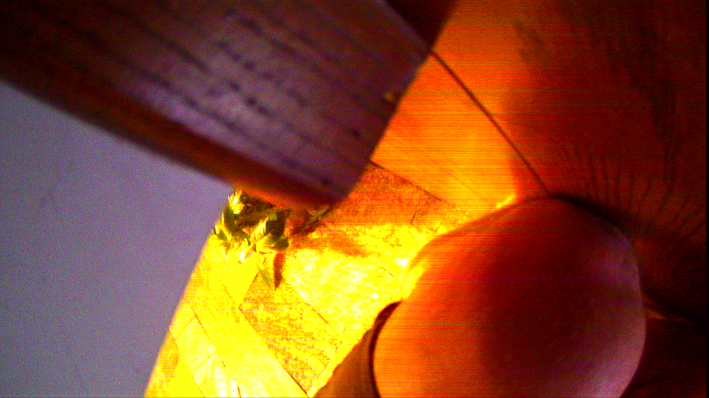
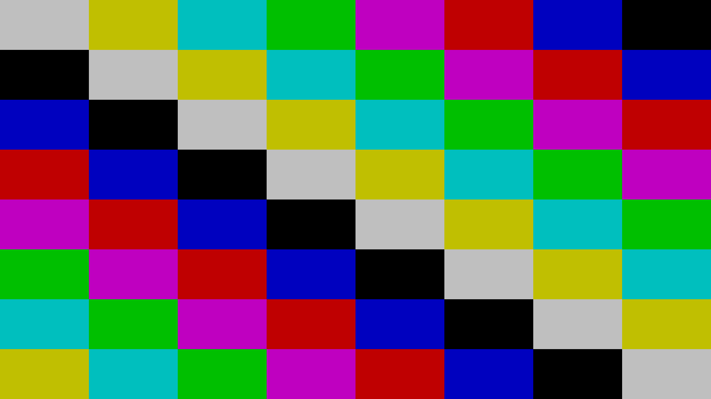

# Porównanie PNG — początek i koniec TEST 2

**Odstępstwo zatwierdzone przez Ownera: te cztery PNG są publiczne. Surowe dane sesji i rastry UYVY nie są publikowane.** Ta decyzja zmienia wcześniejszy zakres prywatności wyłącznie dla poniższych PNG. Wyniki i klasy integralności pozostają bez zmian. Obrazy skopiowano bajtowo z zachowanych wyników, bez kadrowania, obracania, skalowania lub retuszu.

## Początek: +0,046…+0,085 s — diagnostyczny FAIL

Epoka 0, ramka 5479. Widoczne otoczenie i silne przebarwienia. Raster zawiera rzeczywiste 1080 kolejnych linii, lecz nie przeszedł kontroli ciągłości na granicy klatki. Nie przedstawiamy go jako poprawnie zakwalifikowanej klatki live. Sam błąd integralności nie jest powodem zatajenia widocznej treści.

## Około 10 s: +10,016…+10,054 s — PASS

Epoka 0, ramka 5729. Pełna poprawna klatka przedstawiająca kolorową planszę, bajtowo zgodną z historycznym rastrem planszy.

## Koniec: +11,056…+11,094 s — PASS

Epoka 0, ramka 5755. Ostatnia pełna poprawna klatka z tej jednej sesji, również plansza.

## Pierwsza pełna poprawna klatka: +3,736…+3,774 s — PASS

Epoka 0, ramka 5572. To początek odcinka spełniającego ścisłe reguły integralności, a nie początek samego odbioru. Nie zastępuje diagnostycznego rastra z +0,046 s.

## Co wynika z porównania

Zachowano widoczną różnicę między wczesnym diagnostycznym rastrem otoczenia a późniejszą planszą w tej samej sesji. Wszystkie 184 klatki, które przeszły strict check, mają raster identyczny z historyczną planszą. Nie ustalono dokładnej chwili zmiany w niezakwalifikowanym wcześniejszym odcinku, fizycznego źródła planszy ani przyczyny usterki. Interpretacja „coś się psuje i pojawia się syntetyczny obraz” pozostaje hipotezą do wyjaśnienia.

Czasy dotyczą odbioru na hoście, nie ekspozycji. Pierwotny [raport](README.md), [wynik JSON](RESULT.json), [czasy](FRAME_TIMES.csv) i [indeks 184 poprawnych klatek](STRICT_FRAME_INDEX.csv) pozostają zachowane. Zapisane wcześniej w raporcie zdanie o prywatności wszystkich PNG opisuje początkową publikację; powyższa późniejsza zgoda Ownera ujawnia dokładnie cztery PNG, bez raw, firmware'u, źródeł lub logów środowiska.

[Rozmiary i SHA-256 opublikowanych PNG](PNG_PUBLICATION_MANIFEST.json). Nie wykonano nowego capture ani ponownej konwersji dla tej publikacji.
